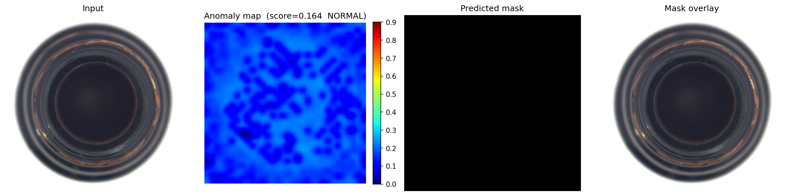
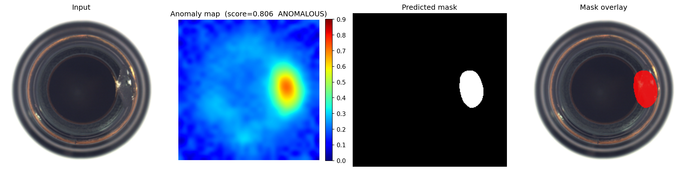
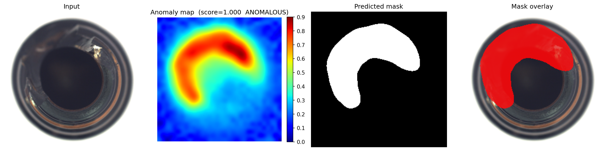

[](LICENSE)


# PatchCore Anomaly Detection

A small project for experimenting with the [PatchCore](https://arxiv.org/abs/2106.08265) anomaly detection algorithm, built on top of [anomalib](https://github.com/openvinotoolkit/anomalib).

PatchCore detects anomalies by building a memory bank of normal patch-level features extracted from a pre-trained CNN backbone. At inference time, the distance of each patch to its nearest neighbour in the memory bank produces a pixel-wise anomaly map and an image-level anomaly score.

A key advantage over many other anomaly detection approaches is that PatchCore requires **only normal (defect-free) samples** for training, so no labelled anomalies are needed. This makes it practical in real-world scenarios where defective examples are rare or hard to collect.

## Requirements

Install all dependencies via:

```bash
pip install -r requirements.txt
```

## Dataset

Training uses the [MVTec Anomaly Detection dataset](https://www.mvtec.com/company/research/datasets/mvtec-ad). Place (or symlink) the extracted dataset at:

```
data/mvtec_anomaly_detection/
```

The expected folder structure mirrors the official MVTec AD layout:

```
data/mvtec_anomaly_detection/
├── bottle/                      ← category name, passed via --category
│   ├── train/
│   │   └── good/                ← normal images only (used for training)
│   │       ├── 000.png
│   │       └── ...
│   └── test/
│       ├── good/                ← normal test images
│       │   ├── 000.png
│       │   └── ...
│       ├── broken_large/        ← one subfolder per defect type (name is arbitrary)
│       │   ├── 000.png
│       │   └── ...
│       └── broken_small/
│           └── ...
├── cable/
└── ...
```

To use your own data, create the same layout under any root folder and point `--data-root` at it. Only `train/good/` is required for training — PatchCore never sees defective images during training.

## Training

Train on a single category (e.g. `bottle`):

```bash
python patchcore.py --category bottle
```

Train on all 15 MVTec AD categories sequentially:

```bash
python patchcore.py --category all
```

### Training options

| Flag | Default | Description |
|---|---|---|
| `--category` | `bottle` | MVTec category to train on, or `all` |
| `--backbone` | `wide_resnet50_2` | Feature extractor (`wide_resnet50_2`, `resnet50`, `resnet18`) |
| `--coreset-ratio` | `0.1` | Fraction of patches kept in the memory bank (lower = faster, less accurate) |
| `--batch-size` | `8` | Batch size for training and evaluation |
| `--num-workers` | `0` | DataLoader worker processes |
| `--data-root` | `data/mvtec_anomaly_detection` | Path to the MVTec AD dataset |
| `--output-dir` | `results` | Directory where checkpoints are saved |

Example with a lighter backbone and smaller coreset:

```bash
python patchcore.py --category bottle --backbone resnet18 --coreset-ratio 0.05
```

Checkpoints are written to `results/<category>/`.

## Inference

Run the trained model on a single image:

```bash
python patchcore.py --infer \
  --checkpoint results/bottle/Patchcore/v1/weights/lightning/model.ckpt \
  --image path/to/image.png
```

Score all images in a folder in a single model load:

```bash
python patchcore.py --infer \
  --checkpoint results/bottle/Patchcore/v1/weights/lightning/model.ckpt \
  --image path/to/folder/
```

### Inference options

| Flag | Description |
|---|---|
| `--checkpoint` | Path to the `.ckpt` file produced during training (required) |
| `--image` | Path to an image file or a directory of images (required) |
| `--output` | Where to save the output PNG (single image) or output directory (folder input) |
| `--show` | Display results interactively via matplotlib |

Each result is saved as a four-panel PNG showing the original image, the anomaly heat map, the predicted binary mask, and a mask overlay on the original.

The model itself evaluates a single image in ~0.20 s. 

### Example outputs

Each result is a four-panel image: original input, anomaly heat map with score, predicted binary mask, and mask overlay. 

**No anomaly**



**Small anomaly**



**Large anomaly**




## Nearest-Neighbour Patch Visualisation

`visualize_nn.py` makes the anomaly decision transparent by showing which training regions are most similar to the anomalous areas of a test image and how large the gap between them is in feature space:

For the top-K most anomalous patches the script produces a figure with four sections:

1. **Test image + heatmap** — the original with colour-coded, numbered bounding boxes for the top-K patches, plus a patch-level anomaly score heatmap (brighter = more anomalous).
2. **Score distribution** — histogram of distances from every patch to its nearest memory-bank entry. Vertical lines mark the top-K patches; a dashed red line shows the learned detection threshold.
3. **Anomaly patches (test image)** — pixel crops from the test image at the top-K positions.
4. **Nearest normal patches (training image)** — the training regions whose feature vector is closest to each anomalous patch.

```bash
python visualize_nn.py \
  --checkpoint results/bottle/Patchcore/MVTecAD/bottle/v0/weights/lightning/model.ckpt \
  --image data/mvtec_anomaly_detection/bottle/test/broken_large/000.png \
  --train-dir data/mvtec_anomaly_detection/bottle/train/good
```

Output is saved as `<image_stem>_nn_viz.png` in the current directory.

### Options

| Flag | Default | Description |
|---|---|---|
| `--checkpoint` | — | Path to `model.ckpt` (required) |
| `--image` | — | Test image to inspect (required) |
| `--train-dir` | — | Folder of normal training images, e.g. `.../train/good` (required) |
| `--top-k` | `3` | Number of most-anomalous patches to visualise |
| `--context-px` | `48` | Side length in pixels of each patch thumbnail |
| `--output` | `<stem>_nn_viz.png` | Output PNG path |
| `--show` | off | Display the figure interactively |

